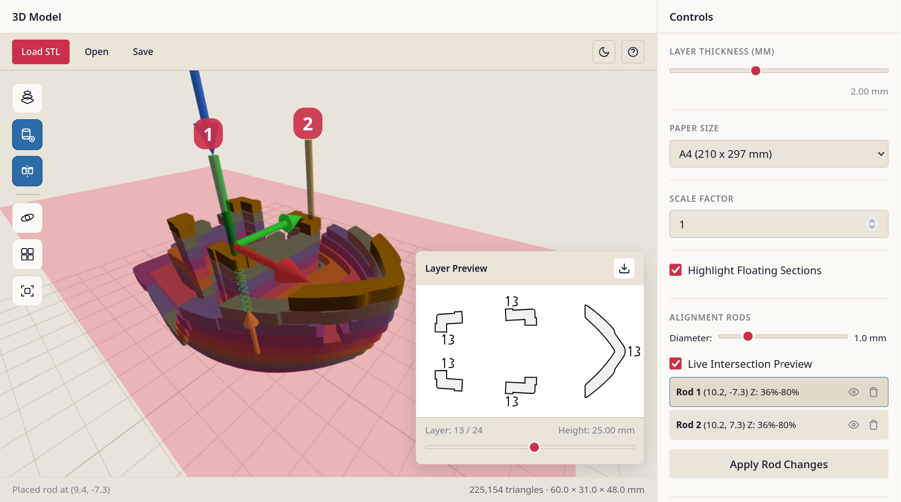
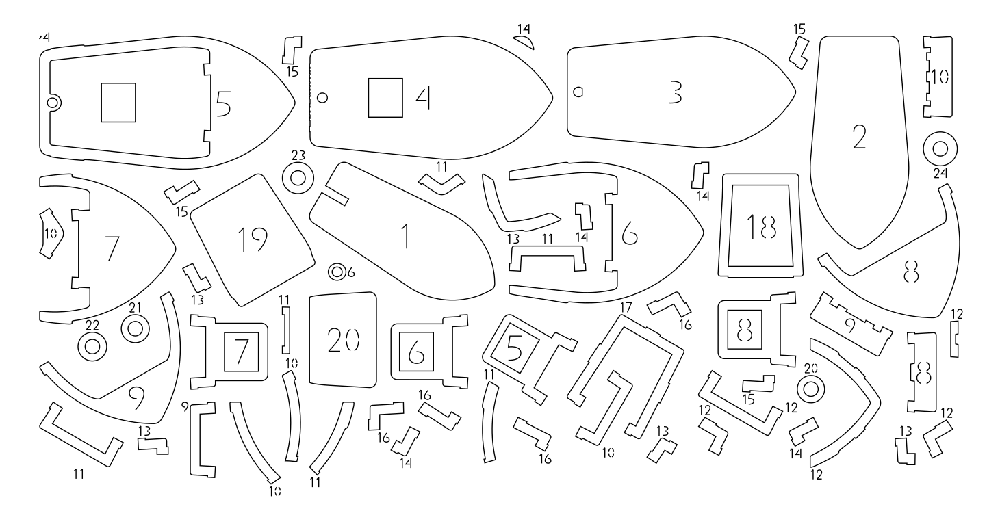

<div align="center">

# millefoglie

A browser tool that turns a 3D model into a stack of paper: it slices an STL into layers the thickness of your paper stock and hands you SVGs ready for a cutter.

Real mesh slicing. Registration holes through the whole stack. Irregular-polygon nesting. Single-stroke layer numbers. Nothing leaves the tab.



</div>

<br/>

## The problem

A 3D printer gets to move its nozzle wherever it likes. A paper craft stack does not. You cut flat sheets and then have to physically stack them, in order, aligned, by hand. That turns one solved problem into three unsolved ones:

- **Registration.** Sheets have to line up. Millefoglie lets you place vertical rods through the model and cuts a matching hole in every layer they pass through, so a dowel threads the stack straight.
- **Ordering.** A model 100 mm tall on 0.5 mm card is 200 near-identical paper shapes, and they become indistinguishable the moment you drop them. Every piece gets its layer number cut into it in a single-stroke font, so the cutter engraves it in one pass rather than outlining each numeral.
- **Material.** Cutting one layer per sheet wastes most of the sheet. The packer nests arbitrary polygons, not bounding boxes, across sheets and reports how much of each it used.

Both export buttons hold the same 200 layers. One of them holds 200 sheets:

```
model_layers.zip                 model_packed.zip
├── README.txt                   ├── packed_sheet_001.svg   # pieces from many layers,
└── layers/                      ├── packed_sheet_002.svg   # nested, each cut with
    ├── layer_0001.svg           └── ...                    # its own layer number
    └── ...
```

The name is Italian for "thousand leaves", the layered pastry. Everything runs in the browser: no server, no upload, nothing leaves your machine.

## Features

- **Real slicing, not a height map**: plane/triangle intersection over the mesh, segments chained into closed contours with gap tolerance, holes detected by winding order
- **Interactive 3D view**: the model, or the assembled slice stack, with the current slice plane in place
- **Orbit and fly navigation**: right-drag to orbit, wheel zooms toward the cursor, double-click re-centres, number keys snap to standard views, and a WASD fly mode is one key away
- **Alignment rods**: click to place, drag the gizmo arrows to adjust, with holes in every layer the rod passes through. Mirror across an axis and the pair stays mirrored afterwards: move or trim either rod and the other follows
- **Live rod preview**: while you aim, the 3D view rings the depths where the rod runs inside the model and flags where it breaks out, and the 2D preview shows the holes it would cut, all before the click that commits it
- **Floating-section detection**: contours with nothing beneath them are highlighted, so you know before cutting which pieces need a tab or a support
- **Nesting**: irregular-polygon packing with rotation, spatial-hash broad phase and polygon-distance narrow phase, run in a Web Worker with live progress and a cancel button
- **Layer numbering**: single-stroke digits cut into each piece, size configurable
- **Light and dark themes**: follows the OS, manual override persists, and export colours are fixed so they never follow the theme
- **Save and reload**: `.mfp` project files carry the mesh, the rods and every setting
- **Built-in help**: <kbd>?</kbd> opens a reference covering workflow, navigation and rods

## Quick start

Requires Node 18 or newer.

```bash
npm install
npm run dev      # http://localhost:3000
```

It opens on a bundled low-poly model, so there is something to slice, scrub and export straight away. Drag an STL onto the window, or press **Load STL**, to replace it. `npm run build` type-checks and bundles to `dist/`, which is fully static and can be dropped on any file host, and `npm run preview` serves that build.

<details>
<summary>Packer benchmark</summary>

`benchmark/` is a headless harness for the packer, with Node adapters standing in for the browser's STL loading, font loading and SVG output so the packing code runs unmodified. Point `benchmark/config/benchmark.config.ts` at an STL of your own: the default expects `./models/3DBenchy.stl`, which is not shipped here. Results land in `benchmark/results/`.

```bash
npm run benchmark            # full quality
npm run benchmark -- --fast  # AABB-only collision, for a quick check
```

</details>

## Using it

1. **Load a model.** STL, binary or ASCII. It is centred and framed automatically.
2. **Set layer thickness** to your paper stock, 0.5 mm for heavy card or 0.1 mm for copy paper. This decides the layer count, and the layer count decides everything else.
3. **Place alignment rods.** Enter rod mode and the rod under the cursor is previewed before you commit it: green rings where it runs inside the model, red arcs where it breaks out, and its holes in the 2D layer preview. Click to place, drag the gizmo to fine-tune. Symmetry mirrors placements across the model's centre and keeps the pair in step from then on.
4. **Scrub the layers.** The slider opens three-quarters up the model, where the geometry is actually interesting, and the 2D preview shows each layer exactly as it will be cut.
5. **Export**, then cut and stack, threading your dowels through the rod holes as you go.



### Controls

| Input | Action |
|---|---|
| Right-drag | Orbit |
| Left-click | Select or place a rod |
| Middle-drag, Shift+left-drag | Pan |
| Wheel | Zoom toward the cursor |
| Double-click | Re-centre on that point |

<details>
<summary>All keyboard shortcuts</summary>

| Key | Action |
|---|---|
| <kbd>?</kbd> <kbd>H</kbd> | Open or close help |
| <kbd>Esc</kbd> | Close help, or leave rod placement mode |
| <kbd>V</kbd> | Toggle between the model and the slice stack |
| <kbd>F</kbd> | Frame the model |
| <kbd>C</kbd> | Switch between orbit and fly navigation |
| <kbd>T</kbd> | Toggle light / dark theme |
| <kbd>1</kbd> <kbd>2</kbd> <kbd>3</kbd> <kbd>4</kbd> | Front / right / top / isometric view |
| <kbd>↑</kbd> <kbd>↓</kbd> <kbd>←</kbd> <kbd>→</kbd> | Next / previous layer |
| <kbd>W</kbd> <kbd>A</kbd> <kbd>S</kbd> <kbd>D</kbd> <kbd>Space</kbd> <kbd>Ctrl</kbd> | Move the camera (fly mode) |
| <kbd>I</kbd> <kbd>J</kbd> <kbd>K</kbd> | Nudge the selected rod along X / Y / Z (<kbd>Shift</kbd> reverses) |
| <kbd>Ctrl</kbd>+<kbd>S</kbd> / <kbd>Ctrl</kbd>+<kbd>O</kbd> | Save / open project |

Rotation steps (12, so every 30°), the 10 mm sheet margin and the 0.2 mm cut stroke are defaults in `src/packing/types.ts` rather than UI controls.

</details>

## How it works

**Slicing.** For each layer height, every triangle straddling the plane is intersected to produce a line segment. The segments come out of the mesh in arbitrary order, so `ContourBuilder` chains them end-to-end into closed loops, welding endpoints within a 2 mm gap tolerance. Meshes in the wild are rarely watertight, and refusing to slice a model over a 0.001 mm crack is not useful behaviour. Closed loops are classified as outer contours or holes by signed area. The gap tolerance and several other slicing constants follow OrcaSlicer's defaults, which is where the comparable heuristics are already well tuned.

**Rods.** A rod is a vertical line segment through the model. `AlignmentRodManager` computes which layers it crosses and emits a circular hole into each of those slices, so a rod spanning part of the model's height only perforates the layers it passes through. Raycasting for placement goes through a BVH (`three-mesh-bvh`), which keeps clicking on a high-triangle mesh instant. The feedback while you aim is cheaper than the real thing, and has to be: it is computed for the layer on screen alone, since re-slicing the model on every cursor move is not affordable. Not seeing the neighbouring layers, it cannot tell that a layer ends a continuous section, so the preview can show a hole the final cut drops.

**Packing.** Each layer becomes a polygon carrying its holes and its layer number. Placement is bottom-left fill over candidate positions with configurable rotation steps. The naive version is O(pieces² × positions × vertices) and takes minutes on a real model, so the collision test is layered: a spatial hash restricts candidates to nearby pieces, a bounding circle rejects most of those with one distance compare, an AABB test rejects most of the rest, and only the survivors reach polygon-to-polygon distance against a simplified contour. Rotation data is precomputed once per piece rather than per candidate position. The whole thing runs in a Web Worker, so the UI stays live and the run can be cancelled.

**Numbering.** Layer numbers are cut, not printed, so they have to be strokes rather than filled outlines. The digits are authored as SVG paths in `src/packing/fonts/digits/`, parsed into Bézier strokes at load, and flattened to polylines at the requested size.

**Exports.** `SliceRenderer` is the single renderer behind the on-screen preview and every export path, so what you see is what gets cut. Its colours are a parameter with a fixed default: the preview passes a dark palette in dark mode, exporters pass nothing and get byte-identical output regardless of theme. A `.mfp` project file is a ZIP holding the mesh plus a JSON manifest of rods, settings and UI state, so the layer you were looking at comes back with it.

## Scope and known gaps

- **STL only.** The file input accepts `.stl` and `App.ts` rejects anything else. No OBJ, 3MF or STEP, and no mesh repair beyond the gap-closing tolerance.
- **Slicing blocks the tab.** Only packing runs in a Worker. `Slicer.slice()` is synchronous on the main thread behind a progress overlay that cannot animate, so a heavy mesh at a fine thickness freezes the window until the whole stack is done. Model size is bounded by what the tab can hold.
- **Nesting is a heuristic.** Bottom-left fill over a fixed set of rotations, not optimal packing, and it never places a small piece inside a larger piece's hole: collision is tested against outer contours only.
- **Floating detection is binary.** Any overlap with the layer below counts as support, so a contour resting on a sliver is not flagged. `analyzeOverhangs()` computes a support percentage, but nothing in the UI calls it yet.
- **No automated tests.** CI runs `npm ci`, `npx tsc --noEmit` and `npm run build`: a compile gate and nothing more. The geometry code has been checked by looking at its output.
- **The benchmark ships no model.** Its config points at `./models/3DBenchy.stl`, which is not in the repository, so the harness needs an STL of your own before it will run.

## Architecture

```
src/
├── core/
│   ├── MeshProcessor.ts        # STL parsing, mesh indexing, normalisation
│   ├── PlaneIntersection.ts    # triangle ∩ plane → segments
│   ├── ContourBuilder.ts       # segments → closed, classified contours
│   ├── OverhangDetector.ts     # unsupported-section detection
│   ├── AlignmentRodManager.ts  # rod → per-layer holes
│   ├── BVHManager.ts           # accelerated raycasting
│   ├── Slicer.ts               # slicing pipeline
│   └── ProjectManager.ts       # .mfp save / load
├── packing/
│   ├── PieceExtractor.ts       # slices → packable polygons
│   ├── Packer.ts               # nesting, collision, rotation search
│   ├── SpatialGrid.ts          # broad-phase spatial hash
│   ├── LabelPlacement.ts       # non-overlapping layer numbers
│   ├── SingleStrokeFont.ts     # stroke-based digits
│   ├── packing.worker.ts       # off-main-thread packing
│   └── PackedSVGExporter.ts    # nested sheets → SVG
├── export/
│   ├── SliceRenderer.ts        # shared geometry → SVG renderer
│   ├── SVGExporter.ts          # one layer per sheet
│   └── ZipExporter.ts          # all layers, zipped
├── components/                 # Viewer3D, LayerPreview, ControlPanel, RodTool, HelpOverlay
├── ui/                         # theme manager, DOM helpers
├── types/                      # geometry, slice, rod, export, project
└── App.ts                      # application controller
```

## Built with

TypeScript, Three.js, Vite, JSZip. No UI framework: the interface is plain DOM, with each component binding to markup by ID.

## License

MIT, see [LICENSE](LICENSE).

The bundled sample, `public/sample/benchy-low-poly.stl`, is a reduced-triangle version of #3DBenchy by [Creative Tools](https://www.3dbenchy.com/), and is not covered by that licence. #3DBenchy is published under CC BY-ND 4.0: attribution is required, and the licence does not cover redistribution of modified versions such as this reduced one. Deleting `public/sample/` is enough to fall back to the empty viewport.
